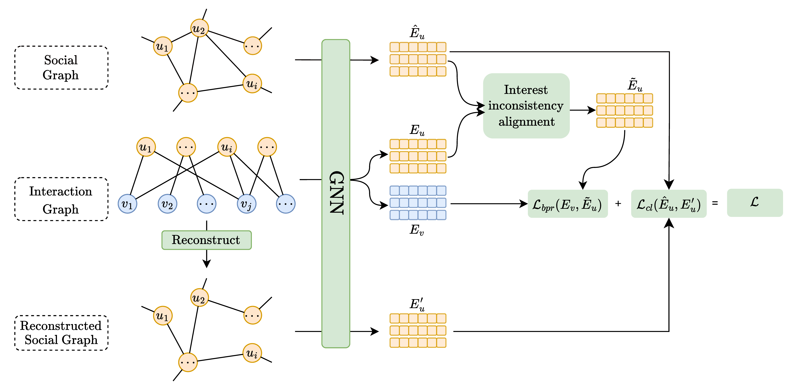
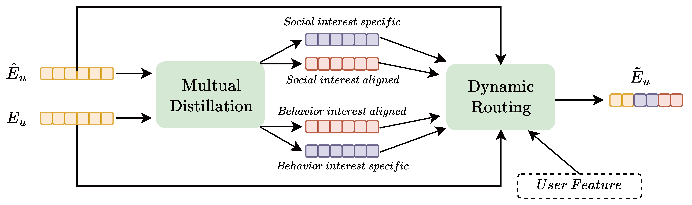

# CSRec
Recommender systems are essential for modern content platforms. Yet, traditional behavior-based recommendation models often struggle with cold users, who have limited interaction data. Despite this, engaging these users is crucial for the ongoing growth of content platforms. To bridge this gap, we propose utilizing the social-relation graph to enrich the interest representation derived from behavior-based models. While social graphs are ubiquitous on content platforms, extracting value from this data is challenging due to social-relation noise and cross-domain interest inconsistency. 

    

*Figure 1: Our proposed contrastive learning social recommendation (\textbf{CSRec}) framework.*

To address the noise propagation issue in graph data and obtain accurate social interest, we employ a dual-view denoising strategy. It initially employs low-rank SVD to the user-item interaction matrix to extract denoised user embeddings for a reconstructed social graph. Subsequently, it utilizes contrastive learning to align the original and reconstructed social graphs. Addressing the interest inconsistency between social and behavioral interests, we adopt a ”mutual distillation” technique to isolate the original interests into four sub-interests, namely aligned social/behavior interests and social/behavior specific interests, which maximally fuse the two interests. 
Experimental results validate the effectiveness of our method, particularly for cold users, demonstrating the benefits of integrating social relations with behavioral data for recommendation platforms.

    

*Figure 1: Interest-inconsistency alignment by mutual distillation and dynamic routing.*

---

# Dataset
We provide two datasets: [LastFM](https://grouplens.org/datasets/hetrec-2011/) and [Ciao](https://www.cse.msu.edu/~tangjili/datasetcode/truststudy.htm).

# Environment

Please install Python 3.8.0, PyTorch 1.7.1, and other requirements as follows: \
`pip install -r requirements.txt`

# Run **CSRec** on the LastFM dataset: 

`python main.py --model=CSRec --dataset=lastfm --decay=1e-4 --lr=0.001 --layer=3 --seed=2020 --topks="[10,20]" --recdim=64 --bpr_batch=2048`
